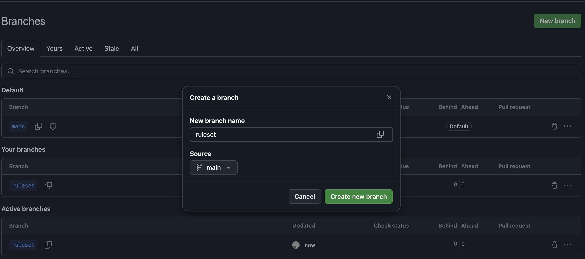
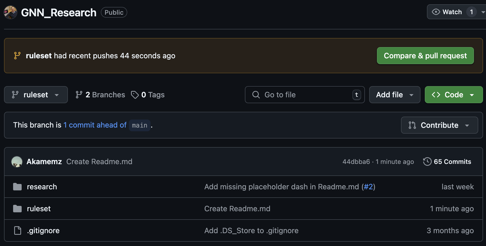
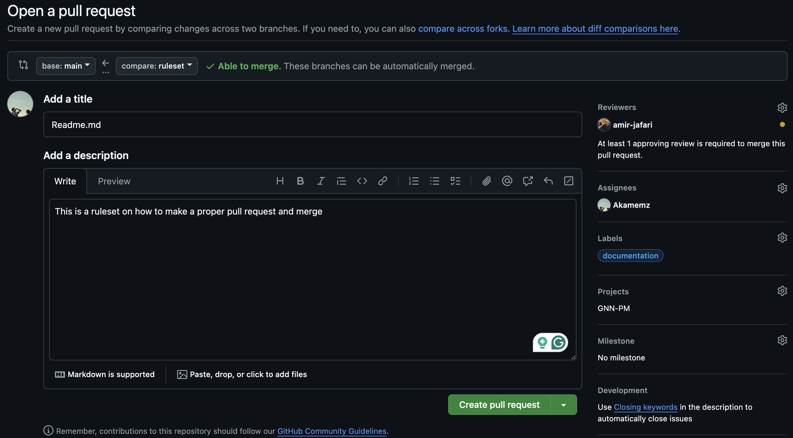
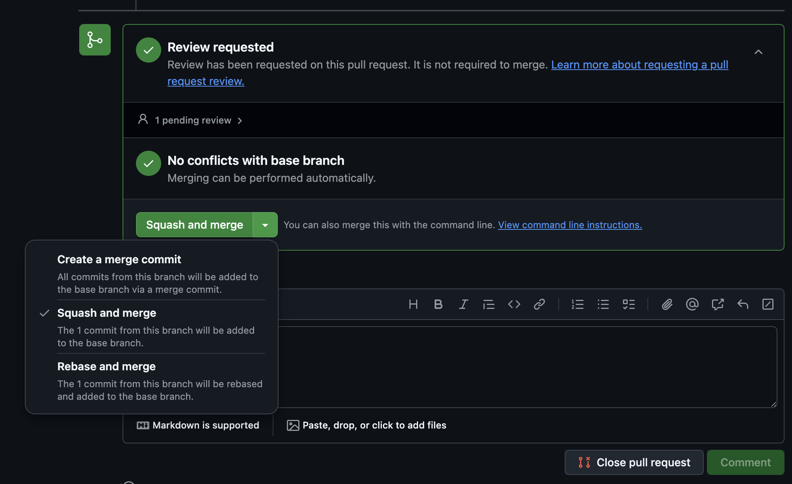
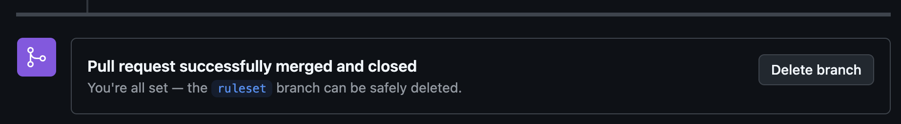

# 🔄 How to Make a Pull Request, Request a Review, and Merge

This guide will help you contribute changes using **pull requests**, perform a **code review**, and **merge** after approval.

---

## Step 1: Create a Pull Request (PR)

1. Make sure your feature branch is **pushed to GitHub**

2. Navigate to the **main repository page**
3. GitHub will often show a banner:

   > “Compare & pull request” — Click it  
   > (Or click **"Pull requests" > "New pull request"** manually)

4. Make sure:
   - `base:` is `main`
   - `compare:` is your branch (e.g. `feat/login-page`)
5. Fill in:

   - **Title** — short and descriptive (e.g., `feat: add login page`)
   - **Description** — explain what and why you changed

6. Click **"Create pull request"**

---

## Step 2: Request a Code Review

1. On the right side of the PR page:
   - Find the **Reviewers** section
2. Click **“gear icon”** or **“Reviewers”**
3. Select the person you want to review your code (mentor or teammate)

> 🔔 The reviewer will be notified and see your code changes side-by-side.

---

## Step 3: Perform a Code Review (Reviewer Side)

If you are the reviewer:

1. Go to the Pull Request tab
2. View all file changes under the **“Files changed”** tab
3. Add **line comments** if you see issues or have questions
4. When done, click **"Review changes"** (top right)

Choose one of the options:

- `Comment` — Just leave feedback
- `Approve` — Approve the PR (if everything is good)
- `Request changes` — Ask the author to make updates

---

## Step 4: Merge the Pull Request

Once the PR is approved and all checks pass:

1. Click the **“Merge pull request”** button
2. Select **“Squash and merge”** (recommended)
3. Confirm with a **meaningful commit message**
4. Click **“Confirm merge”**

✅ You’ve successfully merged your changes into `main`!

---

## Step 5: Clean Up

- After merging, GitHub will prompt you to **delete the branch**
- Click **"Delete branch"**

> 🎉 Done! You can now start your next task by creating a new branch from `main`.

---

&nbsp;

&nbsp;

&nbsp;

&nbsp;

&nbsp;

&nbsp;

> 💡 **Pro Tip: Merge Options in GitHub Pull Requests**

| Merge Type                | Description                                                                    | When to Use It                                                          |
| ------------------------- | ------------------------------------------------------------------------------ | ----------------------------------------------------------------------- |
| **Squash and Merge**      | Combines all commits in the PR into **one clean commit**                       | Preferred when you want a tidy history and easy-to-read commit logs     |
| **Create a Merge Commit** | Merges the branch with a separate commit showing the merge action              | Use if you want to preserve **full commit history and branching**       |
| **Rebase and Merge**      | Rewrites commit history so it appears as if changes were made directly on base | Useful for advanced users who want linear history without merge commits |
