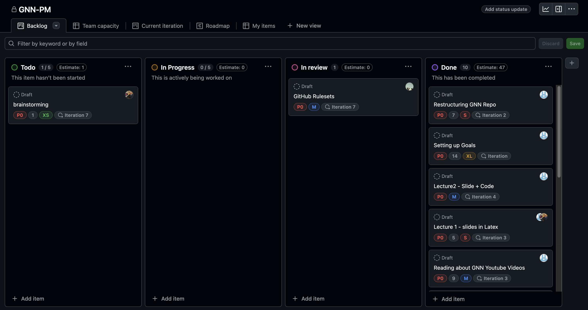
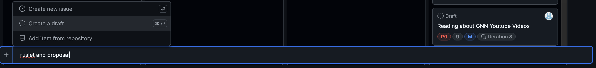
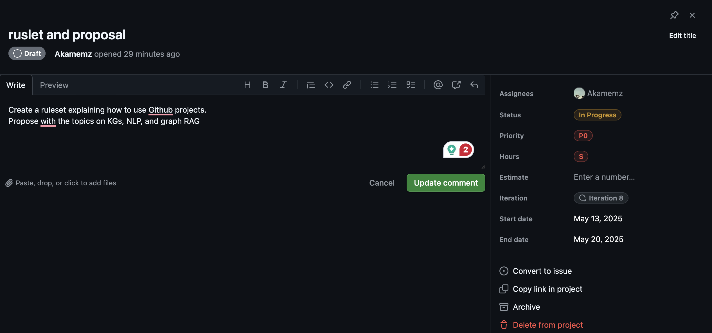
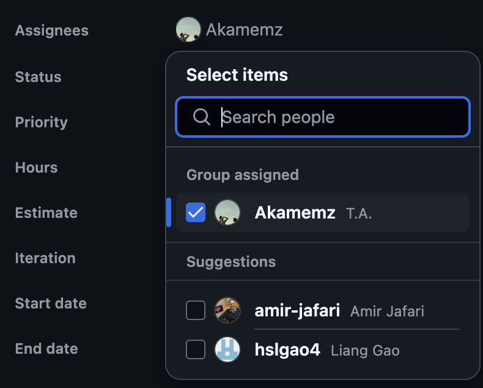
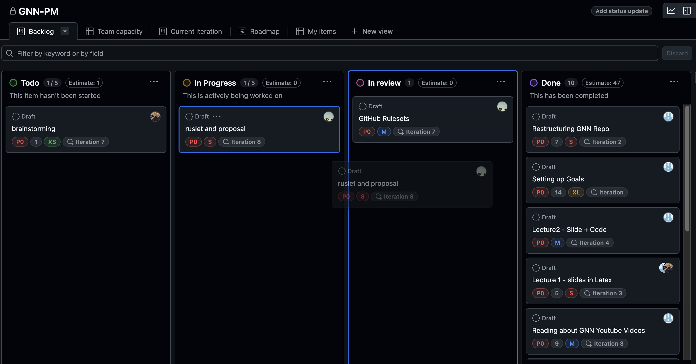

# 🔄 Using GitHub Projects for Task Management and Delegation (GNN-PM Board Layout)

This guide will help you set up and use the **GitHub Projects** board layout for the **GNN-PM** project to manage tasks, create tickets (issues), set priorities (P0, P1, P2 where P0 is least important), manage iterations, and delegate work among team members or peers.

---

## Step 1: Understand the GNN-PM Project Board Layout

1. **Access the Project Board**:

   - Navigate to your repository (e.g., `GNN-PM`) and click the **“Projects”** tab.
   - Open the **GNN-PM** project, which uses a **Board** layout (Kanban-style) with columns: **To Do**, **In Progress**, **In Review**, and **Done**.

   

2. **Key Fields in the Board**:
   - **Status Columns**: Tasks move from `To Do` (not started) to `In Progress` (being worked on), `In Review` (under review), and `Done` (completed). Status can be updated by dragging items between columns.
   - **Priority (P0, P1, P2)**: Indicates task importance, where **P0** is least important, **P1** is medium, and **P2** is most important.
   - **Size (XS, S, M, XL)**: Estimates task effort (e.g., XS for small tasks, XL for large tasks).
   - **Estimate**: Tracks estimated effort in points (e.g., 1, 5, 14 points).
   - **Iteration**: Assigns tasks to time-bound cycles (e.g., `Iteration 7` for current sprint).

---

## Step 2: Create Tickets (Issues) via "+ Add Item"

1. **Add a New Item**:

   - In the **GNN-PM** project board, scroll to the bottom of any column (e.g., `To Do`) and click **“+ Add item”**.
   - Enter a **name** for the task (e.g., `Draft lecture slides for GNN intro`).

   

2. **Save the Initial Ticket**:
   - Press **Enter** or click away to create the ticket. It will appear in the selected column (e.g., `To Do`) with a default status.

---

## Step 3: Edit Ticket Details

1. **Open the Ticket for Editing**:

   - Click the newly created ticket (e.g., `Draft lecture slides for GNN intro`) to open its details pane on the right.

2. **Add Description**:

   - In the **Description** field, explain the task (e.g., “Create 5 slides in LaTeX for GNN introduction, including key concepts”).
   - Use **Markdown** for formatting (e.g., checklists like `- [ ] Draft slide 1`).

3. **Assign Iteration**:

   - In the details pane, find the **Iteration** field and select a cycle (e.g., `Iteration 8: May 20–June 2, 2025`). If not set, click **“+ New field”** > **“Iteration”** to create it.

4. **Assign People**:

   - Under **Assignees**, add team members by selecting their GitHub usernames (e.g., `@team-member1`). Assignees will be notified.

5. **Set Priority**:

   - Apply a priority label via the **Labels** section (e.g., `P0` for least important, `P1` for medium, `P2` for most important).
   - Alternatively, add a **Single Select** field named `Priority` with options `P0`, `P1`, `P2` and assign it.

6. **Set Size and Estimate**:

   - Add a **Size** (e.g., `S` for small tasks) and an **Estimate** in points (e.g., `5`) to reflect effort.

   

7. **Save Changes**:
   - Click **“Save”** or close the pane to update the ticket.

---

## Step 4: Update Status by Dragging

1. **Move Tasks Between Columns**:

   - Drag the ticket to update its status (e.g., move `Draft lecture slides for GNN intro` from `To Do` to `In Progress` when work starts).
   - Continue dragging to `In Review` (e.g., for review) or `Done` (e.g., when completed).

   

2. **Verify Status Change**:
   - The ticket’s column reflects its current status, and the board updates in real-time.

---

## Step 5: Manage Iterations

1. **Understand Iterations**:

   - The board uses an **Iteration** field to assign tasks to cycles (e.g., `Iteration 7` for `brainstorming`, `Iteration 2` for `Restructuring GNN repo`).

2. **Assign or Create Iterations**:

   - Edit the ticket’s **Iteration** field to assign it to a cycle (e.g., `Iteration 8`).
   - Create new iterations via **“+ New field”** > **“Iteration”** with durations (e.g., 2 weeks for `Iteration 8`).

3. **Track Progress per Iteration**:
   - Group by iteration to see tasks per cycle (e.g., `Iteration 7` tasks).
   - Sum the **Estimate** of completed tasks in `Done` (e.g., 47 points) to calculate velocity.

---

## Step 6: Delegate Tasks

1. **Assign Team Members**:

   - In the ticket’s details pane, add assignees under **Assignees** (e.g., assign `Restructuring GNN repo` to a team member).
   - Assignees’ avatars appear on the ticket card.

   

2. **Communicate and Track Progress**:
   - Use **@mentions** (e.g., `@username`) in ticket comments to notify team members.
   - Add updates (e.g., “Completed slide 1”) or use **task lists** (e.g., `- [ ] Draft slide 2`).

---

## Step 7: Track and Review Progress

1. **Use the Board for Kanban Workflow**:

   - The **GNN-PM** board shows tasks in `To Do` (1/5), `In Progress` (0/5), `In Review` (1), `Done` (10).
   - Drag tasks to update status (e.g., move `GitHub Rulesets` to `Done`).

   

2. **Create Saved Views**:

   - Filter tasks (e.g., `Priority: P2` or `Iteration 7`) and save as a view (click **“Save changes”**).
   - Share the view’s URL with your team.

3. **Review Insights**:
   - Track total **Estimate** in `Done` (e.g., 47 points).
   - Use **Matplotlib** locally to chart tasks by priority.

---

## Step 8: Close and Archive

1. **Close Completed Issues**:

   - Move tasks to `Done` (e.g., `Reading about GNN YouTube videos`) or close via the **“Close issue”** button.

2. **Archive Old Tasks**:
   - Archive `P0` or completed tasks to an `Icebox` column.

---

&nbsp;

&nbsp;

&nbsp;

&nbsp;

&nbsp;

&nbsp;

> 💡 **Pro Tip: GNN-PM Project Board Features**

| Feature              | Description                                                      | When to Use It                                             |
| -------------------- | ---------------------------------------------------------------- | ---------------------------------------------------------- |
| **Issues**           | Tickets created via **"+ Add item"** with details edited later.  | Use for quick task creation and detailed editing.          |
| **Priority (P0-P2)** | Labels for importance: `P0` (least), `P1` (medium), `P2` (most). | Use to prioritize (e.g., focus on `P2` tasks).             |
| **Iterations**       | Time-bound cycles (e.g., `Iteration 7`) for planning.            | Use for sprint tracking (e.g., assign to `Iteration 8`).   |
| **Size (XS-XL)**     | Estimates task effort (e.g., `XS`, `XL`).                        | Use to gauge workload (e.g., `XL` for `Setting up goals`). |
| **Estimate**         | Tracks effort in points (e.g., 47 in `Done`).                    | Use to measure velocity.                                   |
| **Drag-and-Drop**    | Updates status by moving tasks between columns.                  | Use for dynamic status updates (e.g., `To Do` to `Done`).  |

---
